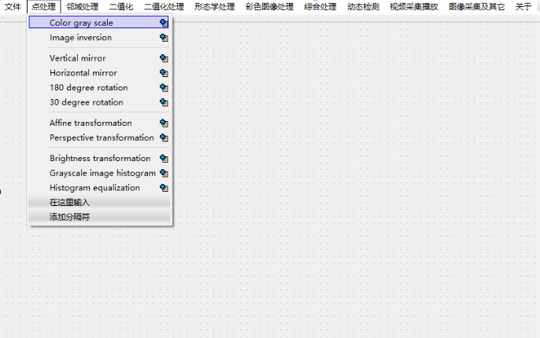

# Imagedemo
本项目是一开始接触图像处理的时候，拿来练手使用，其中基本涵盖了图像处理的最最基础的算法知识，基于vs2012，采用的是opencv2.4与Qt5.2，就是一些图像的最基本的图像算法，有自己实现的，也有很多的是用的opencv的函数，这个项目应该属于年老失修的老古董啦！只从做完就一直没碰过，但感觉多看一下这个代码，对于入门Qt和数字图像处理还是很有好处的，所以一直挂着，希望有所裨益。

